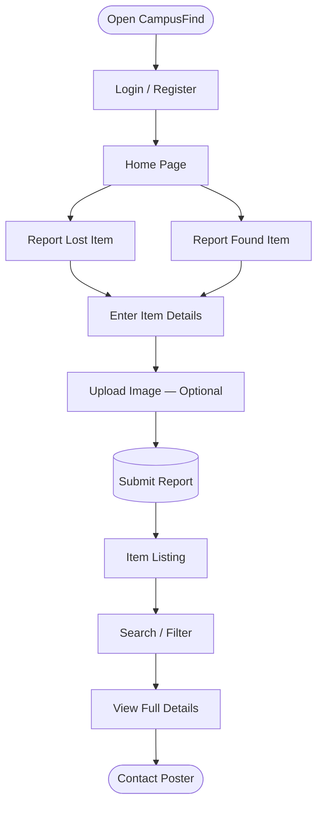
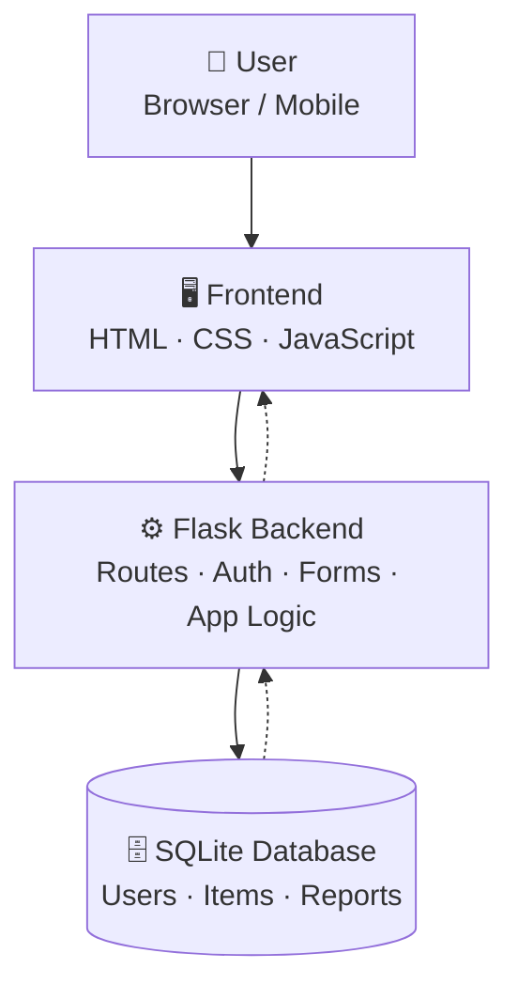
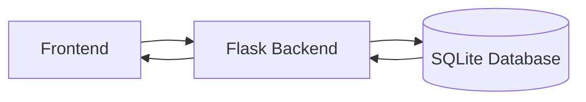

<div align="center">

# 🎓 CampusFind

### Lost. Found. Reconnected.

**A campus-focused Lost & Found web platform that helps students and staff report, discover, and reconnect with lost belongings.**

<br/>

[](https://www.python.org/)
[](https://flask.palletsprojects.com/)
[](https://developer.mozilla.org/en-US/docs/Web/HTML)
[](https://developer.mozilla.org/en-US/docs/Web/CSS)
[](https://developer.mozilla.org/en-US/docs/Web/JavaScript)
[](https://www.sqlite.org/)

[](https://github.com/mohamedabisn/CampusFind/stargazers)
[](https://github.com/mohamedabisn/CampusFind/commits)
[](#-license)

<br/>

[Overview](#-about-the-project) •
[Features](#-key-features) •
[Tech Stack](#-technology-stack) •
[Installation](#-installation) •
[Screenshots](#-screenshots) •
[Author](#-author)

</div>

<br/>

---

## 📌 Table of Contents

| | | |
|---|---|---|
| [🎯 About the Project](#-about-the-project) | [❗ Problem Statement](#-problem-statement) | [💡 Solution](#-solution) |
| [🎯 Objectives](#-objectives) | [✨ Key Features](#-key-features) | [🔄 User Flow](#-user-flow) |
| [⚙️ How It Works](#️-how-campusfind-works) | [🧰 Technology Stack](#-technology-stack) | [🏗️ Architecture](#️-application-architecture) |
| [📁 Project Structure](#-project-structure) | [🗄️ Database](#️-database) | [🚀 Installation](#-installation) |
| [▶️ Running the Project](#️-running-the-project) | [📸 Screenshots](#-screenshots) | [🔐 Security](#-security) |
| [📱 Responsive Design](#-responsive-design) | [🔮 Future Improvements](#-future-improvements) | [🎓 Learning Outcomes](#-learning-outcomes) |
| [📌 Project Highlights](#-project-highlights) | [👨‍💻 Author](#-author) | [⭐ Support](#-support) |

---

## 🎯 About the Project

**CampusFind** is a full-stack Lost & Found web platform purpose-built for college and university environments.

Students and staff can report items they've lost or found on campus, while other users can browse, search, filter, view item details, and directly contact the person who posted a report — replacing scattered messages and notice boards with one organized digital system.

### Items commonly handled

<table>
<tr>
<td align="center">📱<br/><sub>Mobile Phones</sub></td>
<td align="center">💻<br/><sub>Laptops</sub></td>
<td align="center">🎧<br/><sub>Earphones</sub></td>
<td align="center">🎒<br/><sub>Bags</sub></td>
<td align="center">📚<br/><sub>Books</sub></td>
</tr>
<tr>
<td align="center">🪪<br/><sub>ID Cards</sub></td>
<td align="center">🔑<br/><sub>Keys</sub></td>
<td align="center">👕<br/><sub>Clothing</sub></td>
<td align="center">🖊️<br/><sub>Stationery</sub></td>
<td align="center">📦<br/><sub>Other Items</sub></td>
</tr>
</table>

---

## ❗ Problem Statement

Lost belongings on a campus are difficult to recover because information is scattered across disconnected channels. A student who loses an item typically has to:

1. Ask nearby students
2. Contact friends
3. Post in class or department groups
4. Ask faculty members
5. Check with security
6. Wait for whoever found the item to respond

There is no single place where campus members can reliably publish and discover Lost & Found information.

## 💡 Solution

CampusFind consolidates the entire Lost & Found process into one centralized web application.

<table>
<tr>
<th align="left" width="50%">🔴 If a user loses something</th>
<th align="left" width="50%">🟢 If a user finds something</th>
</tr>
<tr>
<td valign="top">

1. Open CampusFind
2. Choose **I Lost Something**
3. Enter item information
4. Add location and description
5. Upload an image *(optional)*
6. Submit the report
7. Other users can discover the listing

</td>
<td valign="top">

1. Open CampusFind
2. Choose **I Found Something**
3. Enter item information
4. Add location and description
5. Upload an image *(optional)*
6. Submit the report
7. The owner can discover the listing and reach out

</td>
</tr>
</table>

CampusFind is built around direct, user-to-user communication.

---

## 🎯 Objectives

- Create a centralized campus Lost & Found platform
- Make reporting lost and found items simple
- Help users discover relevant item reports quickly
- Provide useful, detailed listings and let users contact posters
- Store application data in a structured, reliable database
- Deliver a clean, responsive interface across devices
- Reduce dependence on physical notice boards and scattered messages
- Demonstrate full-stack web development with Python and Flask

---

## ✨ Key Features

| Feature | Description |
|---|---|
| 🔐 **User Authentication** | Users access the app through an authentication system with persistent sessions |
| 🔴 **Lost Item Reports** | Create reports for items a user has lost |
| 🟢 **Found Item Reports** | Create reports for items a user has found, to help return them to the owner |
| 📝 **Detailed Item Info** | Reports capture item name, category, department, color, location, description, image, and status |
| 🖼️ **Image Upload** | Attach a photo of the item when creating a report |
| 🔎 **Keyword Search** | Search reports instantly — e.g. `black wallet` |
| 🗂️ **Category Filters** | Devices/Electronics, Books, Bags, Clothing, Accessories, Other |
| 📍 **Location Tagging** | Library, Canteen, Classroom, Ground, Parking, Other |
| 🎨 **Color Tagging** | Black, White, Red, Blue, Green, Other |
| 🏫 **Department Tagging** | BCA, BBA, CS/IT, VISCOM, BCOM |
| 📋 **Item Detail View** | Open a report to view full details, including poster/contact info |
| 📞 **Direct Contact** | Reach out to a poster to discuss returning or identifying an item |
| ❤️ **Favorites** | Save useful reports for quick access |
| 🔔 **Notifications** | Stay informed of relevant activity |
| 📱 **Responsive UI** | Optimized for desktop, laptop, tablet, and mobile |

---

## 🔄 User Flow



---

## ⚙️ How CampusFind Works

| Step | Stage | Description |
|:---:|---|---|
| 1 | **Authentication** | The user logs into the application |
| 2 | **Browse** | The home page displays available Lost and Found reports |
| 3 | **Search & Filter** | Users search and narrow results using available filters |
| 4 | **Report** | The user selects lost/found and enters the required information |
| 5 | **Submit** | The report is stored in the application's database |
| 6 | **Discover** | Other users browse and search published reports |
| 7 | **Details** | Users open an item to view complete information |
| 8 | **Contact** | An interested user contacts the report's creator |

---

## 🧰 Technology Stack

| Layer | Technology | Purpose |
|---|---|---|
| Frontend | **HTML5** | Page structure |
| Frontend | **CSS3** | Styling and responsive UI |
| Frontend | **JavaScript** | Client-side interactivity |
| Backend | **Python** | Core backend programming |
| Backend | **Flask** | Web application framework |
| Backend | **Jinja Templates** | Dynamic HTML rendering |
| Backend | **Werkzeug** | Flask utilities and security functionality |
| Database | **SQLite** | Structured data storage |
| Tooling | **Git & GitHub** | Version control and source hosting |

---

## 🏗️ Application Architecture



---

## 📁 Project Structure

```text
CampusFind/
├── app.py
├── requirements.txt
├── README.md
├── .gitignore
│
├── templates/
│   ├── index.html
│   └── login.html
│
├── static/
│   ├── css/
│   │   ├── style.css
│   │   └── login.css
│   ├── js/
│   │   ├── script.js
│   │   └── login.js
│   └── images/
│       └── jmc-logo.png
│
└── campusfind.db
```

> ℹ️ `campusfind.db` is a local development database and is excluded from the public repository via `.gitignore`.

---

## 🗄️ Database

CampusFind uses **SQLite** for local data storage — lightweight, file-based, easy to integrate with Flask, and well-suited to academic projects and prototypes.

```text
Users                          Items
├── User information           ├── Item information
├── Authentication data        ├── Lost / Found status
└── Profile information        ├── Category, Department, Color
                                ├── Location & Description
                                └── Image information
```

---

## 🚀 Installation

### 1. Clone the repository

```bash
git clone https://github.com/mohamedabisn/CampusFind.git
cd CampusFind
```

### 2. Create a virtual environment

```bash
python -m venv venv
```

Activate it (Windows):

```bash
venv\Scripts\activate
```

### 3. Install dependencies

```bash
pip install -r requirements.txt
```

---

## ▶️ Running the Project

```bash
python app.py
```

Then open in your browser:

```text
http://127.0.0.1:5000/
```

### 🖥️ Recommended development environment

- Visual Studio Code
- Python 3.x
- Flask
- SQLite
- Git & GitHub
- A modern web browser

---

## 📸 Screenshots

> Add screenshots to a `screenshots/` folder in the project root using the structure below, then update the image paths.

```text
screenshots/
├── campusfind-home.png
├── campusfind-login.png
├── campusfind-report.png
└── campusfind-details.png
```

<div align="center">

| Home Page | Login Page |
|---|---|
|  |  |

| Report Item | Item Details |
|---|---|
|  |  |

</div>

---

## 🔐 Security

The project follows common web application security practices:

- User authentication & session management
- Password protection
- Input handling and validation
- Safe file upload handling
- Database-based data storage
- Sensitive local configuration kept outside Git (`.env`, `*.db`, `uploads/`)

### 🚫 .gitignore

```gitignore
*.db
*.sqlite
*.sqlite3
__pycache__/
*.pyc
.venv/
venv/
.env
static/uploads/*
uploads/*
```

---

## 📱 Responsive Design

CampusFind follows responsive web development principles, adapting cleanly across **Desktop → Laptop → Tablet → Mobile** using CSS layouts and media queries.

---

## 🧩 Core Modules

| Module | Responsibility |
|---|---|
| **Authentication** | Handles user login and session-related functionality |
| **Item Reporting** | Enables users to submit Lost and Found reports |
| **Item Discovery** | Supports browsing, searching, filtering, and sorting |
| **Item Details** | Displays complete information about a selected report |
| **Contact** | Enables communication with the report's poster |
| **Database** | Manages application data using SQLite |
| **Frontend** | Delivers the user interface via HTML, CSS, and JavaScript |

---

## 🔮 Future Improvements

- 📍 Campus map integration & location-based discovery
- 💬 Built-in messaging between users
- 🔔 Improved, real-time notifications
- 📷 Enhanced image management
- ☁️ Cloud database & image storage deployment
- 👤 Enhanced user profiles & activity dashboard
- 🔎 Advanced search capabilities
- 📱 Progressive Web App (PWA) support
- 🏫 Multi-campus support
- 📱 Dedicated mobile application

---

## 🎓 Learning Outcomes

<table>
<tr>
<td width="25%" valign="top">

**Frontend**
- HTML & CSS
- JavaScript
- Responsive design
- UI development

</td>
<td width="25%" valign="top">

**Backend**
- Python & Flask
- Routing
- Forms & sessions
- Server-side logic

</td>
<td width="25%" valign="top">

**Database**
- SQLite
- DB connectivity
- Data storage/retrieval
- Data-driven apps

</td>
<td width="25%" valign="top">

**Practices**
- Git & GitHub
- Project organization
- Virtual environments
- Debugging

</td>
</tr>
</table>

**Full-stack data flow:**



---

## 📌 Project Highlights

- 🌐 **Full-stack web application** combining HTML, CSS, JavaScript, Python, Flask, and SQLite into one complete product
- 🎯 **Solves a real-world problem** faced by students and staff on college campuses
- 👥 **User-centered design** that keeps reporting and discovering lost belongings straightforward
- 🗄️ **Structured database integration** for reliable data storage and retrieval
- 🧱 **Scalable Flask architecture** built as a foundation for future features and deployment

### 🎯 Project Purpose

CampusFind was built as a practical full-stack project demonstrating the ability to identify a real-world problem, design a digital solution, build a frontend and backend, connect a database, handle user interactions, manage application data, and structure a complete software project using Git and GitHub.

---

## 🌐 Repository

**GitHub:** [github.com/mohamedabisn/CampusFind](https://github.com/mohamedabisn/CampusFind)

```bash
git clone https://github.com/mohamedabisn/CampusFind.git
```

---

## 👨‍💻 Author

<div align="center">

### Mohamed Abis

**BCA Student · Full-Stack Developer**

[](https://github.com/mohamedabisn)

**Interests:** Web Development · Python · Flask · Database Applications · UI/UX · Software Development

</div>

---

## ⭐ Support

If you find CampusFind useful or interesting, consider giving the repository a ⭐ on GitHub — it helps a lot!

---

<div align="center">

## 🎓 CampusFind

### Lost. Found. Reconnected.

**Built with Python, Flask, HTML, CSS, JavaScript and SQLite.**

</div>
